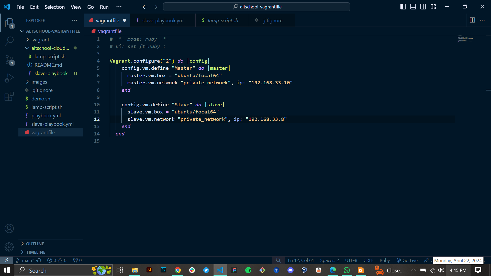
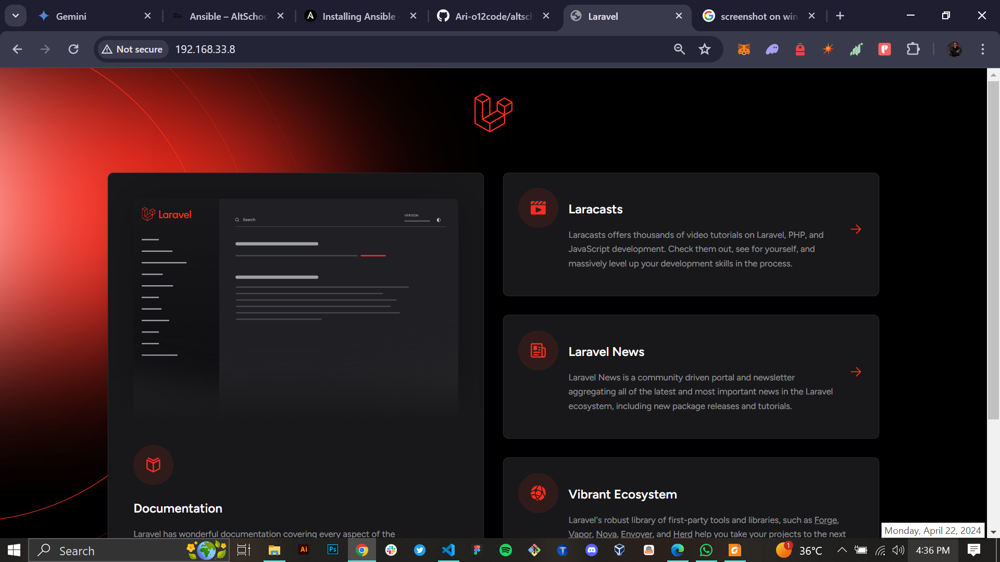
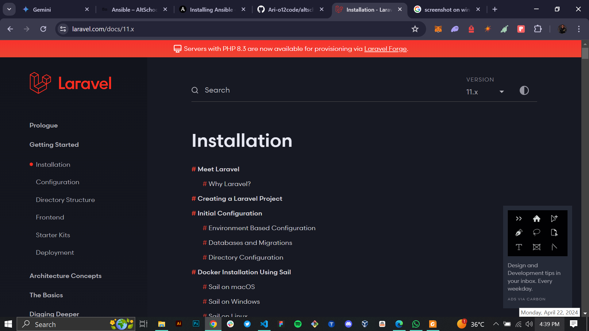

# Altschool Cloud Engineering Second Semester Exam

## Step one: Provisioning of two Ubuntu-based servers using Vagrant
#### Screenshots;

## Step two: create a bash script to automate the deployment of a LAMP stack.
#### Screenshots;

## Step three: Using Ansible playbook to execute the bash script on the Slave node.
#### Screenshots;

## Step four: Using Ansible playbook to create a cron job to check the server's uptime every 12 am.
#### Screenshots;

