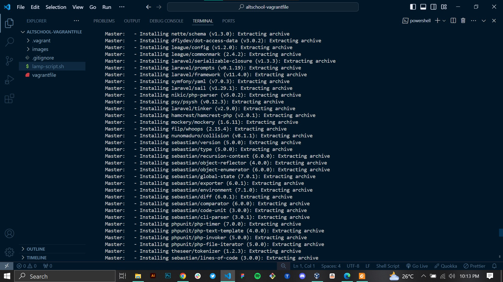

# Altschool Cloud Engineering Second Semester Exam

## Step one: Provisioning of two Ubuntu-based servers using Vagrant
### Screenshots;
#### Images show ubuntu servers provisioning with vagrantfile and their state in virtual box

## Step two: create a bash script to automate the deployment of a LAMP stack.
### Screenshots;
#### Images show the bash script being tested first in the master node

## Step three: Using Ansible playbook to execute the bash script on the Slave node.
### Screenshots;
#### Images show successful execution of bash script on slave node with ansible playbook and site accessibility using slave's IP

## Step four: Using Ansible playbook to create a cron job to check the server's uptime every 12 am.
### Screenshots;
#### Image shows the succesful execution of cron job by ansible playbook

